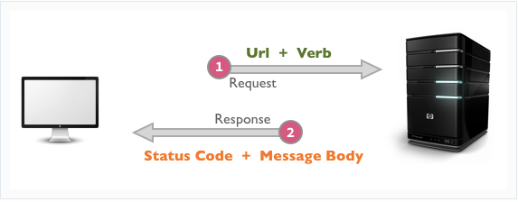

# Fetch

## Cross-Application Communication

Okay now we’re really getting somewhere. So far we’ve been writing programs that consist ENTIRELY of code that we write (or download via npm). Now, we will enter the world of 


A web application's most common asynchronous operation is requesting data from another computer. For example:

- I want my web application to show the current weather. I can request that data from a Weather API.
- I want my web application to show a Google map. I can request that map from the Google Maps API
- I want my web application to find random pictures of dogs on the internet. I can request those images from the [dog api](https://dog.ceo/dog-api/)

## HTTP Request / Response Cycle

HTTP stands for **H**yper**t**ext **T**ransfer **P**rotocol. It is the standard for communication over the internet. (Well HTTPS, the “secure” version, is now the standard).

The HTTP Request/Response cycle is the pattern of communication used by two computers communicating using the HTTP protocol. It works like this:

* The program/computer making the request is the **client**
  * The client must initiate a request. A server can’t reach out and send Responses  to clients on its own. It just waits for incoming requests.
* That program/computer responding to the request is called the **server**
  * The server must already be up and running and ready to accept incoming requests.



* The request and response sent between the client and server each contain important information including:
  * The **request URL** of the specific requested resource
  * The **request verb** — what it wants the server to do (post something new, send back some data, update or delete something)
  * The **response status code** (did the request succeed?)
  * The **response body** (the data sent back to the client)

## The `fetch()` function

`fetch(url)` is a function that sends a request to a server. 
* It is available in browsers and in Node!
* Its only required argument is a URL of the API whose data we want to access.
* It is assumed that the request verb is **GET**.
* `fetch()` returns a `Promise` containing the **HTTP Response**.

```jsx
const fetchPromise = fetch('https://dog.ceo/api/breeds/image/random');
console.log("look, its a promise!:", fetchPromise);

fetchPromise.then((response) => {
  console.log(response.url)	
  console.log(response.ok)
  console.log(response.status)
  console.log(response.statusText)
  console.log(response.body)
});
```

`fetch()` returns a Promise whose resulting value is the `response` object. The `response` object's `url`, `ok` and `status` properties are all useful information. The `ok` and `status` properties immediately tell us if our request was successful and, if not, why.

```jsx
const fetchPromise = fetch('https://dog.ceo/api/breeds/image/random');

fetchPromise.then((response) => {
  if (!response.ok) {
    return console.log(`Failed response. ${response.status} ${response.statusText}`)
  }
  console.log(`The request to ${response.url} was successful!`);
  console.log("Here is your data:", response.body);
});
```

However, the `response.body` is a `ReadableStream` object. We need to do something else to access the data in that stream.

## Parsing the response body

To access the data from the `response` body, we need to parse it, which is another asynchronous operation. Below, you'll see how we've nested these asynchronous operations:

```jsx
// 1. Perform the fetch
fetch('https://dog.ceo/api/breeds/image/random')
  .then((response) => {
    // 2. Check if the response is ok before proceeding
    if (!response.ok) {
      return console.log(`Failed response. ${response.status} ${response.statusText}`)
    }

    // This log isn't necessary but its nice for testing
    console.log(`The request to ${response.url} was successful!`);

    // 3. Parse the body of the response. `response.json()` also returns a Promise that we should handle using `.then`
    response.json()
      .then((responseData) => {
          console.log("Here is your data:", responseData);
          // 4. Render the data to the screen using DOM manipulation
      });
  })
```

- The `response` object has a `.json()` method which parses the body of the response as JSON. 
- **`response.json()` is also asynchronous** and returns a Promise that resolves to the response body.
- Once the data is parsed, we can then use it (print it, render it, etc…)

Here we are using the API from https://dog.ceo/ and the specific “endpoint” URL https://dog.ceo/api/breeds/image/random. Try these other APIs:
- https://dog.ceo/api/breed/hound/images
- https://pokeapi.co/api/v2/pokemon/pikachu
- https://v2.jokeapi.dev/joke/Programming
- https://api.sunrise-sunset.org/json?lat=36.7201600&lng=-4.4203400&date=2023-3-15

## Avoid Nesting, Use Chaining Instead

Rather than nesting the promise handling, we often will chain them together instead:

```js
fetch('https://dog.ceo/api/breeds/image/random')
  .then((response) => {
    if (!response.ok) {
      return console.log(`Failed response. ${response.status} ${response.statusText}`)
    }

    // We can return a promise from `.then` to create a chain of `.then`s
    return response.json()
  })
  .then((responseData) => {
      console.log("Here is your data:", responseData);
      // do something with the response data
  });
```

## Handling Rejected Promises

Remember that all Promises invoke either `resolve()` or `reject()`. Resolved Promises cause the `.then` callback to be invoked while rejected Promises cause the `catch()` callback to be invoked.

Since fetching involves two promises, we should be aware of what can cause those rejections:
* A `fetch()` promise only rejects when the request fails, for example, because of a badly-formed request URL or a network error.
* `response.json()` rejects when the `response` body is in a format other than JSON (which we aren't yet equipped to utilize)

```js

 fetch('https://dog.ceo/api/breeds/image/random')
   .then((response) => {
     if (!response.ok) {
       return console.log(`Fetch failed. ${response.status} ${response.statusText}`)
     }
     return response.json()
   })
   .then((responseData) => {
       console.log("Here is your data:", responseData);
       // do something with the response data
   })
   .catch((error) => {
     console.log("Error caught!");
     console.error(error.message);
   })

```

* When chaining together multiple promises, if either of the Promises returned by `fetch()` or `response.json()` reject, both can be handled by a single `.catch()`:
* Note that A `fetch()` promise does not reject if the server responds with HTTP status codes that indicate errors (404, 504, etc...).

## HTTP Status Codes

Every Response that we receive from a server will include a status code indicating how the request was processed. Was the resource found and returned? Was the resource not found? What there an error? Did the POST request successfully create a new resource? 

Responses are grouped in five classes:

- Informational responses (100 – 199)
- Successful responses (200 – 299)
- Redirection messages (300 – 399)
- Client error responses (400 – 499)
- Server error responses (500 – 599)

Important ones to know are 200, 201, 204, 404, and 500

## URLs

Every URL has a few parts. Understanding those parts can help us fetch precisely the data we want.

Consider this URL which tells us information about the sunrise and sunset at a particular [latitude and longitude](https://en.wikipedia.org/wiki/Geographic_coordinate_system#Latitude_and_longitude):

```
https://api.sunrise-sunset.org/json?lat=36.7201600&lng=-4.4203400&date=2023-3-15
```

Let's break it down:

- `https://api.sunrise-sunset.org` — This is the **host**. It tells the client where the resource is hosted/located.
- `/json` - This is the **path**. It shows what resource is being requested
- `?lat=36.7201600&lng=-4.4203400&date=2023-3-15` - These are **query parameters** and this particular URL has 3: `lat`, `lng`, and `date`. Query parameters begin with a `?` are are separated with `&`. Each parameter uses the format `name=value`. Try changing the `date` parameter!

When using a new API, make sure to look at that APIs [documentation](https://api.sunrise-sunset.org/) (often found at the host address) to understand how to format the request URL.

## Kinds of Requests - HTTP Verbs

HTTP requests can be made for a variety of purposes. Consider these examples related to Instagram:

- The client requests to see all posts made by Beyonce (Read)
- The client requests to post a new picture on their profile (Create)
- The client requests to update a post they made yesterday (Update)
- The client requests to delete a post they made yesterday (Delete)

Each of these actions has an HTTP verb that is associated with it.

- `GET` - Read
- `POST` - Create
- `PATCH` - Update
- `DELETE` - Delete

This HTTP verb or “method” is sent in the HTTP Request so that the server knows what kind of request it is receiving.

The default behavior of using `fetch` is to make a `GET` request, but we can also make other kinds of requests by adding a second `options` argument to `fetch()`:

```jsx
const newUser = { name: "morpheus", job: "leader" };

const options = {
  method: "POST",
  body: JSON.stringify(newUser),
  headers: { "Content-Type": "application/json" },
}

// This is a good API to practice GET/POST/PATCH/DELETE requests
fetch('https://reqres.in/api/users', options)
  .then((response) => {
    if (!response.ok) {
      return console.log(`Fetch failed. ${response.status} ${response.statusText}`)
    }
    return response.json())
  }
  .then((responseData) => {
      console.log("Here is your data:", responseData);
      // do something with the response data
  });
  .catch((error) => {
    console.log("Error caught!");
    console.error(error.message));
  }
```

Most of the `options` object is boilerplate (it's mostly the same each time): 
* The `method` determines the kind of request
* The `headers` determines the type of data we are sending to the server (JSON)
* The `body` determines **what** we send to the server. Note that it must be `JSON.stringify()`-ed first.

The url used here is from https://reqres.in which is a great "dummy" API that you can use to practice making various kinds of fetch requests.
